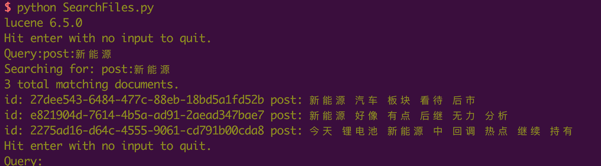

# pylucene get started

## lucene v6.5.0

## install 
* jcc
http://lucene.apache.org/pylucene/jcc/install.html
```
svn co http://svn.apache.org/repos/asf/lucene/pylucene/trunk/jcc jcc
python setup.py install
```

* pylucene
Get [pylucene-6.5.0-src.tar.gz](http://mirror.bit.edu.cn/apache/lucene/pylucene/pylucene-6.5.0-src.tar.gz)
```
tar xzf pylucene-6.5.0-src.tar.gz
cd pylucene-6.5.0-src
# edit Makefile
make
make install
```

## build index
```
text-indexer/scripts/dev.sh
```

## sample
```
python SearchFiles.py
```



[Apache Lucene - Query Parser Syntax](./docs/queryparsersyntax.pdf)